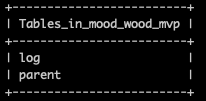
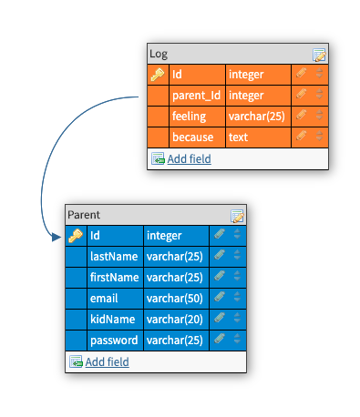
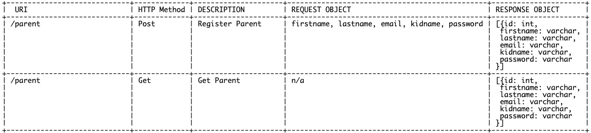
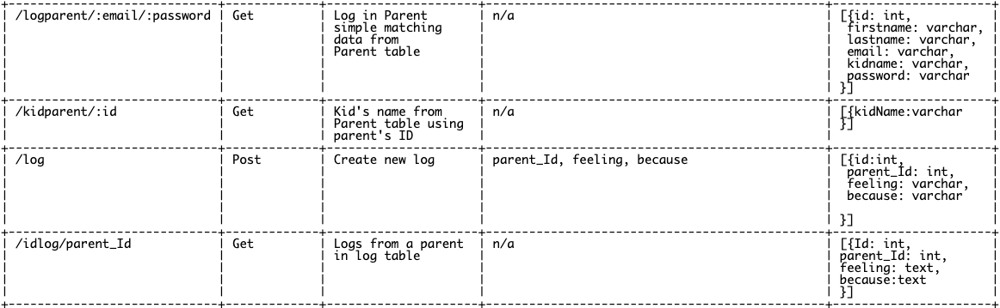
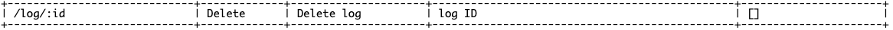
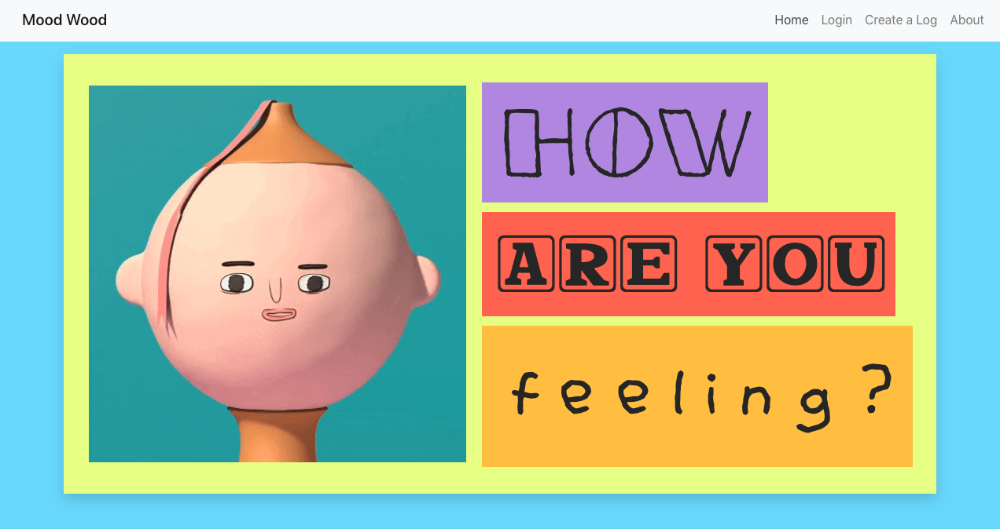
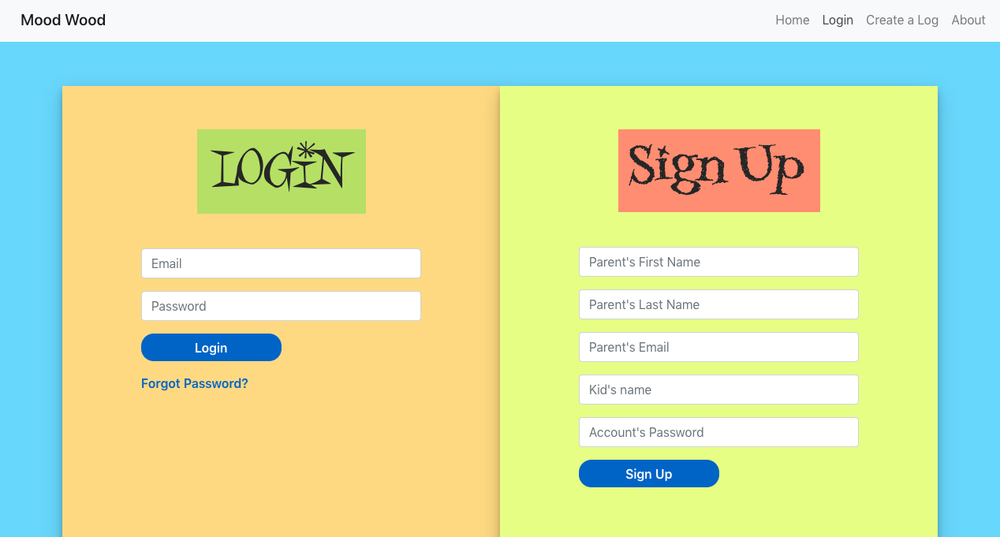
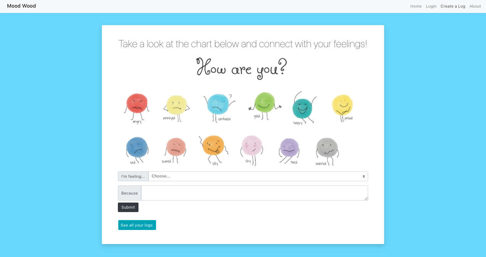
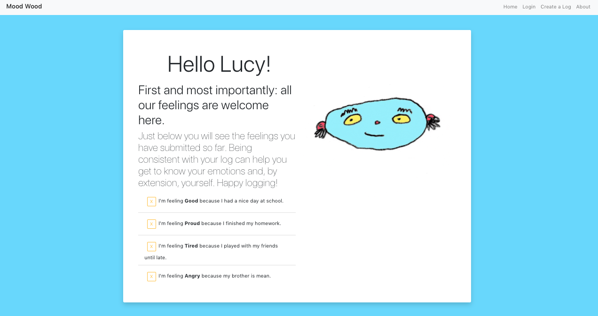
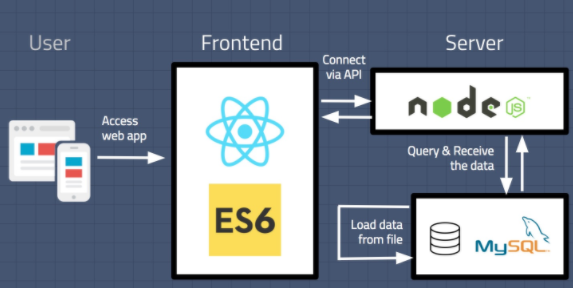

# Mood Wood

This app was thought :thought_balloon: for kids as a tool to develop emotional awareness and literacy skills. 

## Setup :computer:

### :pushpin: Dependencies

* Run `yarn` in project root folder to install express. `yarn start` to run servers on port 5000.
* In the root folder, `cd client`. 
* run `yarn` to install React. 
* `yarn start` to run servers on port 3000.

### :pushpin: Database
Access MySQL :dolphin: in your terminal by running `mysql -u root -p`.
Create new database called mood_wood_mvp: `create database mood_wood_mvp`.
Add a .env file to root folder containing the MySQL authentication information for MySQL user.
Run npm run migrate in the root folder, in a new terminal window. This will create 2 different tables in your database: parent and log.

Your database should look like this:

>The editor used in this project was Visual Studio Code:

Version: 1.41.0
Commit: 9579eda04fdb3a9bba2750f15193e5fafe16b959
Date: 2019-12-11T17:58:38.338Z
Electron: 6.1.5
Chrome: 76.0.3809.146
Node.js: 12.4.0
V8: 7.6.303.31-electron.0
OS: Darwin x64 18.7.0

>MySQL extension used:

Name: MySQL
Id: formulahendry.vscode-mysql
Description: MySQL management tool
Version: 0.4.0
Publisher: Jun Han
VS Marketplace Link: https://marketplace.visualstudio.com/items?itemName=formulahendry.vscode-mysql

### :pushpin: Database schema

### :pushpin: API routes plan :wrench:

 

## Basic User Flow in Pics

## Full stack architecture schema

### Technologies

* MySQL
* Express
* Node.js
* React
* Bootstrap

### Future features :crystal_ball:

* use buttons with feelings instead of a form to create a new log
* be able to retrieve the submitted data using, for example, the felling category
* it would be amazing to get this info back in a graph form :bar_chart:

#### Credit
_This is a student project that was created at [CodeOp](http://CodeOp.tech), a full stack development bootcamp in Barcelona._

