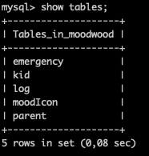
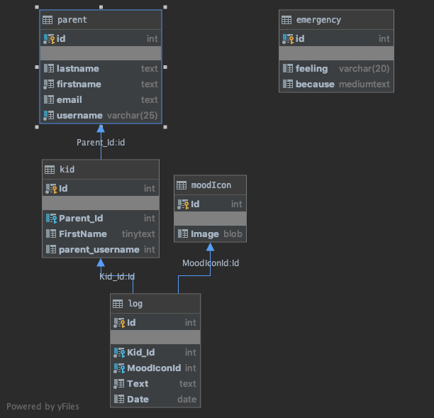

# Mood Wood

This app was thought to be a tool to develop emotional awareness and literacy skills. The target audience would be kids between 6 and 10 years-old. The app consists in creating mood logs that can be accessed through categories and which ocurrences can be displayed considering a certain period of time.

At this stage some minimal features were implemented only. Implementing new features and a more kid friendly design will be tackled in the next steps of this project.

## Setup

### Dependencies

* Run yarn in project root folder to install express. yarn start to run servers on port 5000.
* cd client folder 
* run yarn to install React. 
* yarn start to run servers on port 3000.

### Database
Access MySQL in your terminal by running mysql -u root -p.
Create new database called mood_wood: type create database moodwood.
In MySQL, type use moodwood
Copy and paste de data below (ONE TABLE EACH TIME):
> Apologies in advance for this mess and extra work you have to do! :see_no_evil:
> This is for your patience : :bouquet:

* First table:

create table emergency
(
    feeling varchar(20) null,
    because mediumtext  null,
    id      int auto_increment,
    constraint emergency_ID_uindex
        unique (id)
);

alter table emergency
    add primary key (id);

* Second table:

create table moodIcon
(
    Id    int auto_increment
        primary key,
    Image blob null
);

* Third table:

create table parent
(
    id        int auto_increment,
    lastname  text        null,
    firstname text        not null,
    email     text        null,
    username  varchar(25) not null,
    constraint parent_Id_uindex
        unique (id),
    constraint parent_UserName_uindex
        unique (username)
);

alter table parent
    add primary key (id);

* Fourth table:

create table kid
(
    Id              int auto_increment
        primary key,
    Parent_Id       int      null,
    FirstName       tinytext null,
    parent_username int      null,
    constraint kid_Parent_Id_uindex
        unique (Parent_Id),
    constraint kid_parent__fk
        foreign key (Parent_Id) references parent (id)
            on update cascade on delete cascade
);

* Fifth table:

create table log
(
    Id         int auto_increment
        primary key,
    Kid_Id     int  not null,
    MoodIconId int  not null,
    Text       text not null,
    Date       date null,
    constraint log_Kid_Id_uindex
        unique (Kid_Id),
    constraint log_MoodIconId_uindex
        unique (MoodIconId),
    constraint log_kid__fk
        foreign key (Kid_Id) references kid (Id)
            on update cascade on delete cascade,
    constraint log_moodIcon__fk
        foreign key (MoodIconId) references moodIcon (Id)
            on update cascade on delete cascade
);

Add a .env file to root folder containing the MySQL authentication information for MySQL user.
Install a MySQL extension in your source-code editor.
This will give you access to MySQL directly from your editor where you can see 5 new different tables: in your database: emergency, moodicon, parent, kid and log. 

Your database should look like this:

>The editor used in this project was Visual Studio Code:

Version: 1.41.0
Commit: 9579eda04fdb3a9bba2750f15193e5fafe16b959
Date: 2019-12-11T17:58:38.338Z
Electron: 6.1.5
Chrome: 76.0.3809.146
Node.js: 12.4.0
V8: 7.6.303.31-electron.0
OS: Darwin x64 18.7.0

>MySQL extension used:

Name: MySQL
Id: formulahendry.vscode-mysql
Description: MySQL management tool
Version: 0.4.0
Publisher: Jun Han
VS Marketplace Link: https://marketplace.visualstudio.com/items?itemName=formulahendry.vscode-mysql

### Database schema

 

## User Flow Diagram

This was the first idea. The project in this file looks different and the flow for sure will continue to evolve. 

### Technologies

* MySQL
* Express
* Node.js
* React
* Bootstrap

### Future features

#### Credit

_This is a student project that was created at [CodeOp](http://CodeOp.tech), a full stack development bootcamp in Barcelona._

